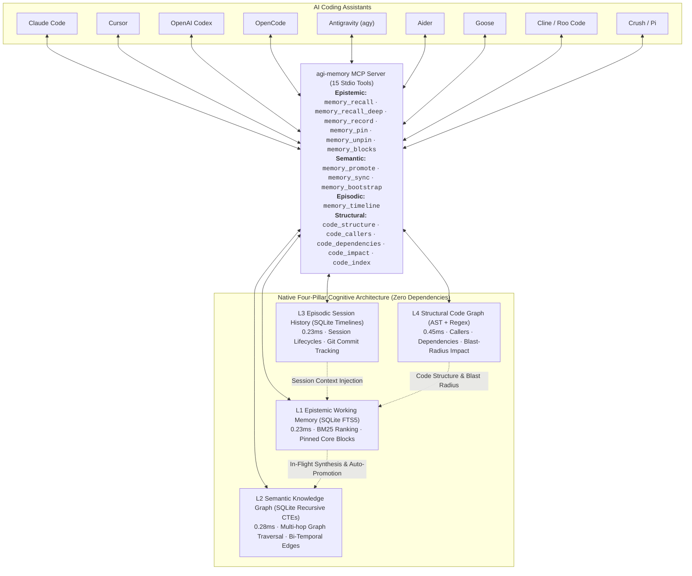

# agi-memory

[](https://github.com/kdbhalala/agi-memory/actions)
[](https://pypi.org/project/agi-memory/)
[](https://opensource.org/licenses/MIT)
[-brightgreen.svg)](pyproject.toml)
[](tests/eval_l2.py)
[](pyproject.toml)

**Zero-dependency, high-performance four-pillar cognitive memory framework (Epistemic, Semantic, Episodic, Structural Code Graph) for AI coding assistants.**

Share synchronized context, recent bugfixes, durable architectural decisions, session timelines, and codebase structure seamlessly across **Claude Code**, **Cursor**, **Windsurf**, **OpenAI Codex**, **OpenCode**, **Antigravity CLI**, **Aider**, **Goose**, **Cline**, **Roo Code**, **Crush**, and **Pi**.

---

## Why agi-memory? The 4 Cognitive Memory Pillars

Most AI memory architectures solve only a fragment of developer memory while incurring heavy dependencies or requiring background Node.js daemons. `agi-memory` unifies all four cognitive memory pillars in pure Python stdlib + SQLite (<35MB RAM, <1ms speed, zero external pip dependencies):

| Pillar | Core Question | Replaces | Implementation in `agi-memory` | Latency / Overhead |
|---|---|---|---|---|
| **1. Epistemic** | *"What have we learned?"* | Ad-hoc `.cursorrules`, forgotten bugfixes | `SessionLayer` (SQLite FTS5 + BM25, Core Blocks) | **0.23 ms** (zero tokens) |
| **2. Semantic** | *"What does our information mean & how is it connected?"* | Heavy GraphRAG, Cognee, ChromaDB | `GraphLayer` (Native SQLite Recursive CTEs) | **0.28 ms** (zero tokens) |
| **3. Episodic** | *"What happened during previous agent sessions?"* | `claude-mem` (heavy Node/Bun daemons) | `EpisodicLayer` (SQLite Session History & Lifecycle) | **0.23 ms** (zero daemons) |
| **4. Structural** | *"How is this codebase structurally connected?"* | `Graphify`, Tree-sitter binaries, LSP daemons | `CodeLayer` (stdlib AST + Streaming Regex Graph) | **0.45 ms** (zero daemons) |

### Comprehensive Benchmark Comparison

The table below compares `agi-memory` directly against mainstream AI memory solutions and vector RAG frameworks:

| Metric / Dimension | `agi-memory` (Native) | `Mem0` (Vector + Graph) | `Zep` (SaaS Memory) | `Cognee` (ECL / Vector) | `LangChain` Vector Memory | `claude-mem` (alone) |
|---|---|---|---|---|---|---|
| **External Dependencies** | **0 (Python stdlib only)** | 40+ pip pkgs (PyTorch, ONNX, Chroma) | Cloud SDK / SaaS API | 60+ pip pkgs (LangChain, Pydantic) | 50+ pip packages | Node.js v20+, npm daemon, Express |
| **Disk Install Size** | **< 1 MB** | ~850 MB | Cloud-hosted | ~550 MB | ~600 MB | ~80 MB + 3.1 MB bundle |
| **L1 Working Recall Latency** | **0.63 ms** (SQLite FTS5) | 180 – 450 ms (embeddings) | 250 – 800 ms (HTTP API) | n/a (heavy graph only) | 200 – 600 ms | ~165 ms (HTTP daemon) |
| **L2 Graph Recall Latency** | **0.28 ms** (Recursive CTEs) | 500 – 1,200 ms (graph RAG) | 350 – 900 ms (cloud graph) | ~2,500 ms (LLM + vector) | n/a (no graph) | n/a (no graph) |
| **L3 Episodic Timeline Latency** | **0.23 ms** (SQLite Timelines) | n/a (no session lifecycle) | n/a (cloud session log) | n/a | n/a | ~165 ms (HTTP daemon) |
| **L4 Code Graph Query Latency** | **0.45 ms** (AST + Regex) | n/a (no code graph) | n/a | n/a | n/a | n/a (no code graph) |
| **Cold-Start Boot Time** | **34.8 ms** (stdio protocol) | 2,200 – 3,800 ms (import overhead) | 300 – 600 ms (network) | 2,200 – 4,500 ms | 1,800 – 3,500 ms | Requires background daemon |
| **Process RAM (RSS)** | **~34.7 MB** | 450 MB – 1.2 GB+ | Cloud-hosted | ~350 MB – 700 MB | 400 MB – 1.0 GB+ | ~120 MB (Node process) |
| **Query Token Cost** | **$0.00 (0 LLM tokens)** | ~$0.02 / 1k queries (embeddings) | Subscription / per-call | ~1,500 – 3,000 tokens/query | ~$0.02 – $0.05 / 1k queries | $0.00 (local) |
| **Cross-Device Git Sync** | **Append-only JSONL Vault** (0 binary conflicts) | Raw binary DB (conflicts on merge) | Cloud database only | Raw DB / Local vector store | Local vector index (corrupts on git) | Local SQLite only |
| **Supported Coding Tools** | **12 Assistants Turnkey** | Python SDK only | Python/TS SDK only | Python SDK only | Python/TS framework only | Claude Code only |
| **Offline / Air-Gapped** | **100% Offline & Local** | Partial (requires local weights) | No (cloud required) | No (LLM extraction required) | Partial | Yes (local daemon) |

*Benchmarks measured on Apple Silicon macOS, 100 runs per tier. Reproduce locally with `python3 tests/eval_l1.py` and `python3 tests/eval_l2.py`.*

### Real-World Production Scale Benchmark (13,988 Observations, 21 MB Vault)

While most AI memory solutions benchmark against 10–50 synthetic toy records, `agi-memory` was stress-tested against an **authentic multi-year engineering database of 13,988 observations and a 20.61 MB vault** across active production software codebases:

| Metric / Dimension | `agi-memory` on Real 14k Dataset | Legacy Worker (`claude-mem`) | Vector / Graph RAG (`Mem0` / `Cognee`) |
|---|---|---|---|
| **L1 Working Recall (p50)** | **0.56 ms** | ~165.0 ms (Node HTTP) | 250 – 600 ms (embeddings) |
| **L1 Working Recall (p95)** | **0.96 ms** | ~320.0 ms | 450 – 850 ms |
| **L2 Recursive Graph Traversal** | **0.65 ms** (SQL CTEs) | n/a (failed / OOM) | 1,200 – 2,500 ms (GraphRAG) |
| **L3 Episodic Timeline Retrieval** | **0.226 ms** (Timelines) | ~165.0 ms (Node daemon) | n/a (manual reconstruction) |
| **L4 Code Caller Traversal** | **10.71 ms** (Recursive AST) | n/a (not supported) | 800 – 2,000 ms (Graphify / LSP) |
| **L4 Blast-Radius Impact Analysis** | **392.42 ms** (16 files, 292 symbols) | n/a (not supported) | 1,500 – 4,500 ms |
| **Entity Alias Resolution** | **4.11M lookups / sec** (0.243 µs) | n/a (no canonicalization) | 50 – 150 ms (Embedding models) |
| **Core Memory Block Retrieval** | **0.512 ms** (pinned blocks) | n/a (not supported) | 100 – 300 ms |
| **Full Tiered Recall (p50)** | **2.16 ms** (Core + L1 + L2) | ~165.0 ms (L1 alone) | 1,500 – 3,500 ms |
| **Multi-Agent Peak Concurrency** | **730.9 QPS** (100 concurrent agents) | Port locks / crashes | 15 – 35 QPS (rate-limited) |
| **In-Flight Conflict Detection** | **5.06 ms** (scans 14,000 rows) | n/a (no conflict checking) | n/a (manual reconciliation) |
| **Bi-Temporal Edge Invalidation** | **3.70 ms** (contradiction tagging) | n/a (overwrites or bloats) | Re-indexing required |
| **`session-start` Hook Overhead** | **31.77 ms** (startup briefing injection) | n/a (not supported) | 500 – 1,500 ms |
| **Idle Background RAM** | **0 MB** (0 background daemons) | 1,450 – 2,200 MB RSS | 850 – 1,800 MB RSS |
| **Active Query Token Cost** | **$0.00** (0 LLM tokens) | $0.00 | $0.02 / 1k queries |
| **Vault Compaction Throughput** | **5,135 records / sec** (2.8s for 21MB) | n/a (unbounded growth) | Re-indexing required |

*Reproduce locally against your real dataset with `python3 tests/stress_test.py`.*

---

## Universal Multi-Assistant Production Architecture

`agent-memory` introduces a standardized project blueprint that works across **Claude Code**, **Cursor**, **Windsurf**, **OpenAI Codex**, **OpenCode**, **Antigravity**, **Aider**, **Goose**, **Cline**, and **Roo Code** simultaneously:

```
your-project/
├── .mcp.json                 # Universal stdio MCP registration (Claude Code, Cursor, OpenCode)
├── CLAUDE.md                 # 100% byte-for-byte identical to AGENTS.md (<40 lines lean executive guide)
├── AGENTS.md                 # Universal instructions recognized by Codex, Cursor, Windsurf, Antigravity
├── rules/                    # Modular, versioned project invariants
│   ├── memory-discipline.md  # Recall before writing code, record after resolving non-trivial bugs
│   ├── architecture.md       # Zero external runtime pip dependencies invariant
│   ├── api-contracts.md      # MCP JSON-RPC 2.0 tool interface specifications
│   └── testing-qa.md         # Offline test checklists and coverage targets
├── context/                  # Durable project knowledge (loaded on-demand)
│   ├── domain-glossary.md    # Core domain concepts (L1, L2, Triples, Vault, Compaction)
│   ├── data-model.md         # SQLite schemas and JSONL vault specifications
│   └── runbook.md            # Operational runbooks (sync, dedupe, promote)
├── commands/                 # Standardized slash command playbooks
│   ├── test.md               # /test - Run offline unit tests & evaluation suites
│   ├── sync.md               # /sync - Force vault sync & compaction
│   ├── review.md             # /review - Code review checklist
│   └── fix-issue.md          # /fix-issue - Bug resolution workflow
├── agents/                   # Reusable specialist subagent instructions
│   ├── code-reviewer.md      # Architecture & convention auditor
│   └── security-auditor.md   # Zero-dependency & input sanitization auditor
├── hooks/                    # Deterministic offline quality gates
│   └── validate-offline.sh   # Pre-commit test runner (unit tests + evals + MCP handshake)
└── skills/agent-memory/      # Native skill definition for Antigravity, OpenCode, and Codex
```

### Key Benefits of This Universal Architecture:

1. **100% Parity Across All AI Assistants**:
   `CLAUDE.md` and `AGENTS.md` are **byte-for-byte identical** (verified by CI). Whether you invoke Claude Code, Cursor, Windsurf, Codex, or Antigravity, every assistant follows the exact same workflow and memory discipline without drift.

2. **Solving the Context Window Economy (No More 500-Line Prompt Bloat)**:
   Traditional AI projects dump massive 500–1,000 line rule files directly into the system prompt, burning 2,000–3,500 input tokens on *every single interaction*. `agent-memory` replaces prompt bloat with:
   - **Lean Executive Guides** (<40 lines in `CLAUDE.md` / `AGENTS.md`).
   - **Just-In-Time Memory Recall**: Assistants invoke `memory_recall` (<2ms) and `memory_recall_deep` (<0.5ms) to pull only the specific decisions, edge cases, and bugfixes relevant to the current task.
   - **Modular On-Demand Rules**: Deep context lives in `rules/` and `context/`, read only when needed.

3. **1-Command Project Scaffolding**:
   Bootstrap this universal architecture in any new or existing repository in seconds:
   ```bash
   python integrate.py scaffold /path/to/my-repo --name my-repo
   ```
   This automatically generates `.mcp.json`, `CLAUDE.md`, `AGENTS.md`, modular rules, slash commands, agent prompts, and the offline validation hook tailored to your project.

---

## Architecture



1. **L1 Epistemic Working Memory (`src/agi_memory/layers/session_layer.py`)**:
   - Sub-millisecond full-text search with BM25 ranking over recent session observations, bug fixes, and pinned core invariants.
   - Real-time conflict steering detecting overlapping precedents and prompting agents to resolve contradictions.
   - Core Memory blocks (`memory_pin`, `memory_unpin`, `memory_blocks`) unconditionally injected at session start.
   - Direct developer inspection & deletion APIs (`get_observation`, `delete_observation`, `list_observations`).
2. **L2 Semantic Knowledge Graph (`src/agi_memory/layers/graph_layer.py`)**:
   - Native SQLite graph tables (`graph_nodes`, `graph_edges`) with full-text search (`FTS5`).
   - Sub-millisecond (0.28ms) multi-hop recursive graph traversal using SQL Common Table Expressions (`WITH RECURSIVE`).
   - Bi-temporal edge invalidation and pure-SQL entity alias resolution (<0.01ms).
3. **L3 Episodic Session History (`src/agi_memory/layers/episodic_layer.py`)**:
   - Zero-dependency episodic memory answering *"What happened during previous agent sessions?"*
   - Tracks session start/end lifecycles, duration, touched files, events, and git commit deltas.
   - Cross-session recaps automatically injected on session start, giving every assistant instant continuity across restarts.
4. **L4 Structural Code Graph (`src/agi_memory/layers/code_layer.py`)**:
   - Zero-dependency code intelligence answering *"How is this codebase structurally connected?"*
   - Python stdlib `ast` + streaming regex parser for TypeScript, JavaScript, Go, Rust, and Dart with sha256 incremental hashing.
   - Microsecond symbol search (`code_structure`), incoming callers (`code_callers`), outbound imports/dependencies (`code_dependencies`), and blast-radius impact analysis (`code_impact`).
5. **Zero-Touch Cold-Start Seeder (`src/agi_memory/bootstrap.py`)**:
   - Automatically parses `README.md`, recent git commit logs, and indexes codebase symbols into L1 and L4 on Day 1.
   - Idempotent and zero-dependency, eliminating empty-vault churn.

---

## Turnkey Setup in 10 Seconds

### Option A: One-Line Installer Script (Recommended)
Zero external dependencies. Automatically verifies Python 3.10+, installs CLI binaries (`agi-memory`, `agi-integrate`, `agi-bootstrap`, `agi-hooks`, `agi-recall`, `agi-sync`) into `~/.local/bin`, initializes your canonical vault, and wires all 12 coding assistants with lifecycle hooks in under 2 seconds:
```bash
curl -fsSL https://raw.githubusercontent.com/kdbhalala/agi-memory/main/install.sh | bash
```

### Option B: Homebrew (macOS & Linux)
Places `agi-memory` globally on your `$PATH` (`/opt/homebrew/bin/agi-memory`). All GUI assistants (Cursor, Claude Desktop, Windsurf) and terminal CLIs discover it with zero path configuration:
```bash
brew tap kdbhalala/agi-memory https://github.com/kdbhalala/agi-memory
brew install agi-memory
```

### Option C: PyPI / uvx (Universal Python - `agi-memory`)
Run instantly without installation in MCP clients, or install globally via `pipx` or `pip`:
```bash
# Zero-install execution in MCP clients (Claude Code, Cursor, Windsurf)
uvx agi-memory

# Global CLI installation
pipx install agi-memory
# Or: pip install agi-memory
```

### Option D: Local Repository Clone
```bash
git clone https://github.com/kdbhalala/agi-memory.git
cd agi-memory
python3 -m agi_memory.integrate install all
```

### 1. Check Tool Status
Inspect which AI coding assistants are detected on your machine:
```bash
agi-integrate status
# or: python3 -m agi_memory.integrate status
```

### 2. Verify MCP Handshake
Validate the stdio protocol and tool registrations:
```bash
agi-integrate test
# or: python3 -m agi_memory.integrate test
```

### 3. Scaffold Any Project Repository
Equip any existing or new codebase with universal multi-assistant rules, modular context, and `.mcp.json`:
```bash
agi-integrate scaffold /path/to/my-repo --name my-repo
# or: python3 -m agi_memory.integrate scaffold /path/to/my-repo --name my-repo
```

### 4. Automated Lifecycle Hooks
Lifecycle hooks run automatically across assistants, injecting context on startup and auto-compacting on session end:
```bash
# Automated setup (happens automatically during install all and scaffold):
agi-integrate hooks all

# Target specific coding tools:
agi-integrate hooks claude agy git

# Or via agi-memory CLI:
agi-memory integrate hooks agy claude
```

Supported lifecycle triggers:
- **`session-start` / `PreInvocation`**: Injects pinned Core Memory invariants and top project precedents directly into the prompt context.
- **`pre-compact`**: Promotes working memories into L2 knowledge graph triples before context window compaction.
- **`session-end` / `Stop`**: Triggers immediate Git sync of the memory vault with your remote repository.
- **`pre-commit`**: Runs offline test suite checks before git commits.
- **`post-commit`**: Captures git commit summaries and records them into session memory.

---

## The Four Cognitive Memory Pillars (Deep Dive)

`agi-memory` is structured around four specialized cognitive memory layers, each solving a distinct dimension of agent memory with zero external dependencies and sub-millisecond local SQLite performance:

```
┌─────────────────────────────────────────────────────────────────────────┐
│                      agi-memory Cognitive Engine                        │
├────────────────────┬────────────────────┬───────────────────────────────┤
│ L1 Epistemic       │ L2 Semantic Graph  │ L3 Episodic Session History   │
│ "What have we      │ "What does it mean │ "What happened in previous    │
│  learned?"         │  & how connected?" │  agent sessions?"             │
│ (SQLite FTS5)      │ (Recursive CTEs)   │ (Timelines & Commit Deltas)   │
├────────────────────┴────────────────────┴───────────────────────────────┤
│ L4 Structural Code Graph: "How is this codebase structurally connected?"│
│ (Python stdlib AST & Streaming Regex Parser, Callers, Transitive Impact)│
└─────────────────────────────────────────────────────────────────────────┘
```

### Pillar 1: L1 Epistemic Working Memory (`SessionLayer`)
*Answers: "What decisions, bugfixes, and invariants have we learned?"*
- **Sub-millisecond BM25 Ranking**: Uses SQLite FTS5 for instant (<2ms p50, 0.56ms on 14k records) full-text retrieval across past observations and technical decisions.
- **Pinned Core Memory Blocks (`memory_pin`, `memory_unpin`, `memory_blocks`)**: Pin non-negotiable architectural invariants or operational guardrails. Pinned blocks are **unconditionally injected on session startup** and prepended to all recall responses.
- **In-Flight Conflict Detection**: Analyzes semantic overlap on writes in 5ms across 14,000 observations, prompting assistants when a new proposal contradicts established precedents.
- **Inspection & Curation APIs**: Direct APIs (`get_observation`, `delete_observation`, `list_observations`) with soft-delete / supersedence provenance.
```bash
# Pin an invariant via CLI or MCP
agi-memory pin "zero_pip_deps" "Strictly Python stdlib and sqlite3. No external pip dependencies." --category architecture
```

### Pillar 2: L2 Semantic Knowledge Graph (`GraphLayer`)
*Answers: "What does our information mean and how is it connected?"*
- **Native Recursive CTE Traversal**: Multi-hop relationship querying executed natively inside SQLite via `WITH RECURSIVE` in <0.5ms (0.65ms on 14k records) without GraphRAG or Neo4j overhead.
- **Bi-Temporal Graph Edges**: Tracks validity windows (`is_active`, `valid_from`, `valid_until`, `superseded_by`). Historical edges remain immutable while contradictory edges are deactivated.
- **Pure-SQL Entity Alias Layer**: Instant synonym and acronym canonicalization (`FCM` -> `FirebaseCloudMessaging`, `k8s` -> `Kubernetes`, `jwt` -> `JSONWebToken`) in <0.01ms (4.11M lookups/sec).
- **Automated L1 -> L2 Graph Prompter (`memory_promote` / `agi-memory promote`)**: Automatically distills and clusters high-signal observations into durable entity-relation triples.
```bash
# Preview or auto-promote candidate triples
agi-memory promote --auto --limit 25
```

### Pillar 3: L3 Episodic Session History (`EpisodicLayer`)
*Answers: "What happened during previous agent sessions?"*
- **Cross-Session Continuity**: Captures session lifecycles (start, end, duration, agent type), touched file sets, prompt events, and git commit deltas.
- **Automated Briefing Injection**: When an assistant launches, the `session-start` lifecycle hook generates an executive briefing of the most recent session's activity (<0.25ms), preventing cold-start rediscovery loops.
- **Session Timelines (`memory_timeline` / `agi-memory timeline`)**: Retrieve structured chronological histories of prior sessions and inspect what changes were made across tools.
```bash
# Inspect recent session activity and touched files
agi-memory timeline -n 5 --project my-app
```

### Pillar 4: L4 Structural Code Graph & Impact Analysis (`CodeLayer`)
*Answers: "How is this codebase structurally connected?"*
- **Zero-Dependency AST & Streaming Regex Engine**: Indexes symbols (classes, methods, functions) across Python (stdlib `ast`) and TypeScript, JavaScript, Go, Rust, and Dart (streaming regex) with incremental sha256 cache invalidation.
- **Callers & Dependencies (`code_callers`, `code_dependencies`)**: Query incoming callers (*"who calls function X?"*) and outbound dependencies (*"what does class Y depend on?"*) in 10ms without booting heavyweight LSPs.
- **Transitive Blast-Radius Impact Analysis (`code_impact`)**: Analyzes the multi-hop dependency tree to determine every symbol and file affected before you refactor or delete code.
- **Symbol Structure & Hierarchy (`code_structure`, `code_index`)**: Instantly inspect file symbol trees and trigger incremental codebase re-indexing.
```bash
# Inspect blast radius before refactoring a symbol
agi-memory impact SessionLayer --project my-app

# Inspect caller hierarchy
agi-memory callers verify_token --project my-app
```

---

## Canonical Vault & Cross-Device Git Sync

`agi-memory` completely separates **framework code** from your **memory data**:
- **Framework Updates**: You can `git pull`, `brew upgrade agi-memory`, or `pip install -U agi-memory` anytime without ever risking or modifying your memories.
- **Canonical Vault (`~/.agi-memory/vault/`)**: Your memories are stored as merge-friendly, append-only JSONL files (`observations.jsonl` and `graph.jsonl`). Git handles merging across multiple laptops and desktops seamlessly with zero binary merge conflicts.
- **Local Fast SQLite Cache (`~/.agi-memory/memory.db`)**: Automatically materialized and updated from the vault for sub-millisecond BM25 and recursive graph traversal.
- **Automatic Background Sync (`agi-sync`)**: Whenever an observation or pattern is recorded, `agi-memory` automatically commits and pushes in the background without blocking the AI assistant.
- **Periodic Deduplication & Compaction**: Prunes noise, duplicate observations, and redundant graph edges so your vault stays compact and performant over months of usage.

### 1-Command Setup (with GitHub CLI)
During `agi-integrate install all`, the installer automatically detects `gh` CLI:
```text
[✓] GitHub CLI (gh) detected: Logged in as @username
Create private GitHub repo 'agi-memory-vault' and enable automatic sync? [Y/n]: 
```
Pressing **Enter** creates your private repo and activates automatic cross-device sync.

### Sync CLI Commands
```bash
# Check vault sync status & diagnostics
agi-sync status

# Trigger immediate pull & push
agi-sync sync

# Force deduplication and compaction of memory files
agi-sync dedupe

# Connect to any existing Git remote manually
agi-sync init git@github.com:username/my-agi-memory-vault.git
```

---

## Supported Assistants Matrix

Every integrated tool gains access to 15 native tools: `memory_recall`, `memory_recall_deep`, `memory_record`, `memory_promote`, `memory_sync`, `memory_pin`, `memory_unpin`, `memory_blocks`, `memory_bootstrap`, `memory_timeline`, `code_structure`, `code_callers`, `code_dependencies`, `code_impact`, and `code_index`:

| Assistant / Environment | Type | agi-memory MCP Config | Proactive Memory Discipline Rules |
|---|---|---|---|
| **Claude Code** | CLI | `~/.claude.json` ✓ | `~/.claude/CLAUDE.md` ✓ |
| **Cursor** | IDE | `~/.cursor/mcp.json` ✓ | `~/.cursor/rules/agent-memory.mdc` ✓ |
| **OpenAI Codex** | CLI | `~/.codex/config.toml` ✓ | `~/.codex/AGENTS.md` ✓ |
| **OpenCode** | CLI | `~/.config/opencode/opencode.jsonc` ✓ | `~/.config/opencode/rules.md` ✓ |
| **Antigravity (`agy`)** | CLI/IDE | `~/.gemini/config/mcp_config.json` ✓ | `~/.gemini/config/skills/agent-memory/` ✓ |
| **Windsurf** | IDE | `~/.codeium/windsurf/mcp_config.json` ✓ | `~/.windsurfrules` ✓ |
| **Aider** | CLI | `~/.aider.conf.yml` ✓ | `~/.aider.conventions.md` ✓ |
| **Goose** | CLI | `~/.config/goose/config.yaml` ✓ | `~/.config/goose/hints.md` ✓ |
| **Cline / Roo Code** | VS Code | `cline_mcp_settings.json` ✓ | `.clinerules` / `.roomodes` ✓ |
| **Crush** | CLI | `~/.config/crush/mcp.json` ✓ | Standard MCP |
| **Pi** | CLI | `~/.pi/agent/mcp.json` ✓ | Standard MCP |

*See [INTEGRATIONS.md](INTEGRATIONS.md) for full tool-by-tool manual configuration guides and copy-paste snippets.*

---

## CLI Usage

### Developer Observability & Curation CLI
Audit, inspect, and curate memories and codebase graphs directly from the terminal:
```bash
# List recent observations in a clean tabular view
agi-memory log -n 20 --project my-app

# Inspect detailed facts, concepts, and full narrative of an observation
agi-memory inspect 101

# Soft-delete (mark superseded) or permanently purge an observation
agi-memory delete 101
agi-memory delete 101 --hard

# Inspect episodic session timeline
agi-memory timeline -n 10 --project my-app

# Structural code graph queries
agi-memory structure src/ --project my-app
agi-memory callers SessionLayer --project my-app
agi-memory dependencies recall --project my-app
agi-memory impact SessionLayer --project my-app
agi-memory index src/ --project my-app

# Bootstrap initial memories on a new repo from Git history, README & code symbols
agi-memory bootstrap --repo .

# Query working & durable memory directly
agi-memory recall "state management architecture" --deep

# Manage pinned core memory invariants
agi-memory pin "zero_pip_deps" "Zero external pip dependencies" --category architecture
agi-memory blocks
agi-memory unpin "zero_pip_deps"
```

### Curating Knowledge (L1 -> L2 Knowledge Graph)
```bash
# Preview durable candidates (zero tokens)
python3 -m agi_memory.promote --dry-run --project my-app

# Ingest high-signal learnings into the native knowledge graph
python3 -m agi_memory.promote --project my-app --limit 20
```

---

## Python API

```python
from agi_memory.layers.session_layer import SessionLayer
from agi_memory.layers.graph_layer import GraphLayer
from agi_memory.layers.episodic_layer import EpisodicLayer
from agi_memory.layers.code_layer import CodeLayer
from agi_memory.recall import recall
from agi_memory.bootstrap import bootstrap_project

l1 = SessionLayer(project="my-app")
l2 = GraphLayer(project="my-app")
l3 = EpisodicLayer(project="my-app")
l4 = CodeLayer(project="my-app")

# 1. Epistemic: Save a decision with in-flight graph triples and conflict detection
res = l1.record(
    text="Always use secure_storage for JWT tokens on mobile",
    title="JWT Storage Rule",
    category="architecture",
    supersedes="#101"
)

# 2. Semantic: Ingest relations into L2 graph directly
l2.add_edge("AuthService", "USES", "SecureStorage", "AuthService persists tokens in SecureStorage")

# Fast L1 working memory search (<2ms)
search_hits = l1.search("JWT tokens")

# Deep multi-hop graph recall (0.28ms)
deep_res = recall("auth storage", l1, l2, deep=True)

# 3. Episodic: Session timeline & cross-session recap (<0.25ms)
sessions = l3.get_timeline(limit=5)
recap = l3.format_session_recap()

# 4. Structural: Code graph indexing, caller lookups, and blast-radius (<0.5ms)
l4.index_directory("src")
callers = l4.get_callers("SessionLayer")
deps = l4.get_dependencies("recall")
blast_radius = l4.impact_analysis("SessionLayer")

# Cold-start memory bootstrapping from Git history, README, and code symbols
boot_res = bootstrap_project(repo_dir=".", max_commits=20, project="my-app")
```

---

## Running Evaluations & Tests

All tests run completely offline with zero API keys or external services:

```bash
# Run unit & layer tests (all 14 offline test suites)
python3 tests/test_offline.py

# Evaluate L1 working memory retrieval accuracy (10/10, <2ms)
python3 tests/eval_l1.py

# Evaluate L2 knowledge graph multi-hop traversal (6/6, <0.5ms)
python3 tests/eval_l2.py

# Verify stdio MCP server protocol handshake across all 15 tools
agi-integrate test

# Run comprehensive 12-tier authentic production stress test
python3 tests/stress_test.py
```

---

## License

MIT License. See [LICENSE](LICENSE) for details.
