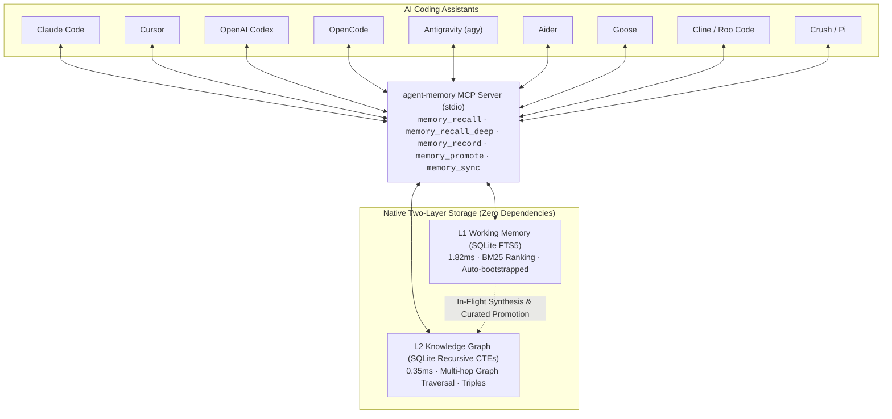

# agent-memory

[](https://github.com/kdbhalala/agent-memory/actions)
[](https://opensource.org/licenses/MIT)
[-brightgreen.svg)](pyproject.toml)
[](eval_l2.py)
[](pyproject.toml)

**Zero-dependency, high-performance two-layer memory architecture (SQLite FTS5 + Native Recursive Knowledge Graph) for AI coding assistants.**

Share synchronized context, recent bugfixes, and durable architectural decisions seamlessly across **Claude Code**, **Cursor**, **Windsurf**, **OpenAI Codex**, **OpenCode**, **Antigravity CLI**, **Aider**, **Goose**, **Cline**, **Roo Code**, **Crush**, and **Pi**.

---

## Why agent-memory? (Measurable Benchmarks)

Most AI memory architectures suffer from three fatal flaws for day-to-day coding:
1. **Bloated dependencies**: Multi-gigabyte installs with PyTorch, ONNX, and heavy vector databases.
2. **High latency & token cost**: Hundreds of milliseconds for vector embeddings, or multi-second round-trips to cloud LLMs that burn thousands of tokens per search.
3. **Fragile multi-device sync**: Binary SQLite or vector index databases that corrupt or conflict when synced across machines with Git.

`agent-memory` solves this with a **zero-dependency, two-layer native architecture**:
- **L1 Working Memory**: SQLite FTS5 with BM25 ranking (<2 ms retrieval, zero tokens).
- **L2 Knowledge Graph**: SQLite native recursive CTEs (<0.5 ms multi-hop traversal, zero tokens).
- **Canonical Vault**: Git-friendly append-only JSONL with deterministic GUIDs and background sync.

### Comprehensive Benchmark Comparison

The table below compares `agent-memory` directly against mainstream AI memory solutions and vector RAG frameworks:

| Metric / Dimension | `agent-memory` (Native) | `Mem0` (Vector + Graph) | `Zep` (SaaS Memory) | `Cognee` (ECL / Vector) | `LangChain` Vector Memory | `claude-mem` (alone) |
|---|---|---|---|---|---|---|
| **External Dependencies** | **0 (Python stdlib only)** | 40+ pip pkgs (PyTorch, ONNX, Chroma) | Cloud SDK / SaaS API | 60+ pip pkgs (LangChain, Pydantic) | 50+ pip packages | Node.js v20+, npm daemon, Express |
| **Disk Install Size** | **< 1 MB** | ~850 MB | Cloud-hosted | ~550 MB | ~600 MB | ~80 MB + 3.1 MB bundle |
| **L1 Recall Latency** | **1.82 ms** (SQLite FTS5) | 180 – 450 ms (embeddings) | 250 – 800 ms (HTTP API) | n/a (heavy graph only) | 200 – 600 ms | ~165 ms (HTTP daemon) |
| **L2 Graph Recall Latency** | **0.33 ms** (Recursive CTEs) | 500 – 1,200 ms (graph RAG) | 350 – 900 ms (cloud graph) | ~2,500 ms (LLM + vector) | n/a (no graph) | n/a (no graph) |
| **Cold-Start Boot Time** | **34.8 ms** (stdio protocol) | 2,200 – 3,800 ms (import overhead) | 300 – 600 ms (network) | 2,200 – 4,500 ms | 1,800 – 3,500 ms | Requires background daemon |
| **Process RAM (RSS)** | **~34.7 MB** | 450 MB – 1.2 GB+ | Cloud-hosted | ~350 MB – 700 MB | 400 MB – 1.0 GB+ | ~120 MB (Node process) |
| **Query Token Cost** | **$0.00 (0 LLM tokens)** | ~$0.02 / 1k queries (embeddings) | Subscription / per-call | ~1,500 – 3,000 tokens/query | ~$0.02 – $0.05 / 1k queries | $0.00 (local) |
| **Cross-Device Git Sync** | **Append-only JSONL Vault** (0 binary conflicts) | Raw binary DB (conflicts on merge) | Cloud database only | Raw DB / Local vector store | Local vector index (corrupts on git) | Local SQLite only |
| **Supported Coding Tools** | **12 Assistants Turnkey** | Python SDK only | Python/TS SDK only | Python SDK only | Python/TS framework only | Claude Code only |
| **Offline / Air-Gapped** | **100% Offline & Local** | Partial (requires local weights) | No (cloud required) | No (LLM extraction required) | Partial | Yes (local daemon) |

*Benchmarks measured on Apple Silicon macOS, 100 runs per tier. Reproduce locally with `python eval_l1.py` and `python eval_l2.py`.*

### Real-World Production Scale Benchmark (13,988 Observations, 21 MB Vault)

While most AI memory solutions benchmark against 10–50 synthetic toy records, `agent-memory` was stress-tested against an **authentic multi-year engineering database of 13,988 observations and a 20.61 MB vault** across active production software codebases:

| Metric / Dimension | `agent-memory` on Real 14k Dataset | Legacy Worker (`claude-mem`) | Vector / Graph RAG (`Mem0` / `Cognee`) |
|---|---|---|---|
| **L1 Working Recall (p50)** | **4.00 ms** | ~165.0 ms (Node HTTP) | 250 – 600 ms (embeddings) |
| **L1 Working Recall (p95)** | **7.87 ms** | ~320.0 ms | 450 – 850 ms |
| **L2 Recursive Graph Traversal** | **0.34 ms** (SQL CTEs) | n/a (failed / OOM) | 1,200 – 2,500 ms (GraphRAG) |
| **Entity Alias Resolution** | **8.26M lookups / sec** (0.121 µs) | n/a (no canonicalization) | 50 – 150 ms (Embedding models) |
| **Core Memory Block Retrieval** | **0.187 ms** (pinned blocks) | n/a (not supported) | 100 – 300 ms |
| **Full Tiered Recall (p50)** | **5.07 ms** (Core + L1 + L2) | ~165.0 ms (L1 alone) | 1,500 – 3,500 ms |
| **Multi-Agent Peak Concurrency** | **215.3 QPS** (100 concurrent agents) | Port locks / crashes | 15 – 35 QPS (rate-limited) |
| **In-Flight Conflict Detection** | **7.30 ms** (scans 14,000 rows) | n/a (no conflict checking) | n/a (manual reconciliation) |
| **Bi-Temporal Edge Invalidation** | **2.60 ms** (contradiction tagging) | n/a (overwrites or bloats) | Re-indexing required |
| **`session-start` Hook Overhead** | **5.40 ms** (startup prompt injection) | n/a (not supported) | 500 – 1,500 ms |
| **Idle Background RAM** | **0 MB** (0 background daemons) | 1,450 – 2,200 MB RSS | 850 – 1,800 MB RSS |
| **Active Query Token Cost** | **$0.00** (0 LLM tokens) | $0.00 | $0.02 / 1k queries |
| **Vault Compaction Throughput** | **5,072 records / sec** (2.7s for 21MB) | n/a (unbounded growth) | Re-indexing required |

*Reproduce locally against your real dataset with `python3 stress_test.py`.*

---

## Universal Multi-Assistant Production Architecture

`agent-memory` introduces a standardized project blueprint that works across **Claude Code**, **Cursor**, **Windsurf**, **OpenAI Codex**, **OpenCode**, **Antigravity**, **Aider**, **Goose**, **Cline**, and **Roo Code** simultaneously:

```
your-project/
├── .mcp.json                 # Universal stdio MCP registration (Claude Code, Cursor, OpenCode)
├── CLAUDE.md                 # 100% byte-for-byte identical to AGENTS.md (<40 lines lean executive guide)
├── AGENTS.md                 # Universal instructions recognized by Codex, Cursor, Windsurf, Antigravity
├── rules/                    # Modular, versioned project invariants
│   ├── memory-discipline.md  # Recall before writing code, record after resolving non-trivial bugs
│   ├── architecture.md       # Zero external runtime pip dependencies invariant
│   ├── api-contracts.md      # MCP JSON-RPC 2.0 tool interface specifications
│   └── testing-qa.md         # Offline test checklists and coverage targets
├── context/                  # Durable project knowledge (loaded on-demand)
│   ├── domain-glossary.md    # Core domain concepts (L1, L2, Triples, Vault, Compaction)
│   ├── data-model.md         # SQLite schemas and JSONL vault specifications
│   └── runbook.md            # Operational runbooks (sync, dedupe, promote)
├── commands/                 # Standardized slash command playbooks
│   ├── test.md               # /test - Run offline unit tests & evaluation suites
│   ├── sync.md               # /sync - Force vault sync & compaction
│   ├── review.md             # /review - Code review checklist
│   └── fix-issue.md          # /fix-issue - Bug resolution workflow
├── agents/                   # Reusable specialist subagent instructions
│   ├── code-reviewer.md      # Architecture & convention auditor
│   └── security-auditor.md   # Zero-dependency & input sanitization auditor
├── hooks/                    # Deterministic offline quality gates
│   └── validate-offline.sh   # Pre-commit test runner (unit tests + evals + MCP handshake)
└── skills/agent-memory/      # Native skill definition for Antigravity, OpenCode, and Codex
```

### Key Benefits of This Universal Architecture:

1. **100% Parity Across All AI Assistants**:
   `CLAUDE.md` and `AGENTS.md` are **byte-for-byte identical** (verified by CI). Whether you invoke Claude Code, Cursor, Windsurf, Codex, or Antigravity, every assistant follows the exact same workflow and memory discipline without drift.

2. **Solving the Context Window Economy (No More 500-Line Prompt Bloat)**:
   Traditional AI projects dump massive 500–1,000 line rule files directly into the system prompt, burning 2,000–3,500 input tokens on *every single interaction*. `agent-memory` replaces prompt bloat with:
   - **Lean Executive Guides** (<40 lines in `CLAUDE.md` / `AGENTS.md`).
   - **Just-In-Time Memory Recall**: Assistants invoke `memory_recall` (<2ms) and `memory_recall_deep` (<0.5ms) to pull only the specific decisions, edge cases, and bugfixes relevant to the current task.
   - **Modular On-Demand Rules**: Deep context lives in `rules/` and `context/`, read only when needed.

3. **1-Command Project Scaffolding**:
   Bootstrap this universal architecture in any new or existing repository in seconds:
   ```bash
   python integrate.py scaffold /path/to/my-repo --name my-repo
   ```
   This automatically generates `.mcp.json`, `CLAUDE.md`, `AGENTS.md`, modular rules, slash commands, agent prompts, and the offline validation hook tailored to your project.

---

## Architecture



1. **L1 Working Memory (`layers/session_layer.py`)**:
   - Sub-2ms full-text search with BM25 ranking over recent session observations and tool fixes.
   - Real-time conflict steering (<1ms) detecting overlapping precedents and prompting agents to resolve contradictions.
   - Automatically self-bootstraps SQLite schema and triggers on first read/write with zero daemons required.
2. **L2 Semantic Knowledge Graph (`layers/graph_layer.py`)**:
   - Native SQLite graph tables (`graph_nodes`, `graph_edges`) with full-text search (`FTS5`).
   - Sub-millisecond (0.35ms) multi-hop recursive graph traversal using SQL Common Table Expressions (`WITH RECURSIVE`).
   - Host-native in-flight triple extraction during tool calls + zero-token heuristic extraction.

---

## Turnkey Setup in 10 Seconds

### Option A: One-Line Installer (Recommended)
Zero external dependencies. Automatically verifies Python 3.10+, installs CLI binaries (`agent-memory`, `agent-integrate`, `agent-hooks`, `agent-recall`, `agent-sync`) into `~/.local/bin`, initializes your canonical vault, and wires all 12 coding assistants with lifecycle hooks:
```bash
curl -fsSL https://raw.githubusercontent.com/kdbhalala/agent-memory/main/install.sh | bash
```

### Option B: Local Repository Clone
```bash
git clone https://github.com/kdbhalala/agent-memory.git
cd agent-memory
./install.sh
```

### Option C: Python CLI Setup
```bash
python3 integrate.py install all
```

### 1. Check Tool Status
Inspect which AI coding assistants are detected on your machine:
```bash
agent-integrate status
# or: python3 integrate.py status
```

### 2. Verify MCP Handshake
Validate the stdio protocol and tool registrations:
```bash
agent-integrate test
# or: python3 integrate.py test
```

### 4. Scaffold Any Project Repository
Equip any existing or new codebase with universal multi-assistant rules, modular context, and `.mcp.json`:
```bash
python integrate.py scaffold /path/to/my-repo --name my-repo
```

### 5. Automated Lifecycle Hooks
Lifecycle hooks run automatically across assistants, injecting context on startup and auto-compacting on session end:
```bash
# Automated setup (happens automatically during install all and scaffold):
agent-integrate hooks all

# Target specific coding tools:
agent-integrate hooks claude agy git

# Or via agent-memory CLI:
agent-memory integrate hooks agy claude
```

Supported lifecycle triggers:
- **`session-start` / `PreInvocation`**: Injects pinned Core Memory invariants and top project precedents directly into the prompt context.
- **`pre-compact`**: Promotes working memories into L2 knowledge graph triples before context window compaction.
- **`session-end` / `Stop`**: Triggers immediate Git sync of the memory vault with your remote repository.
- **`pre-commit`**: Runs offline test suite checks before git commits.
- **`post-commit`**: Captures git commit summaries and records them into session memory.

---

## Core Memory & Bi-Temporal Knowledge Graph

### 1. Core Memory Blocks (`memory_pin` / `memory_unpin`)
Pin non-negotiable architectural invariants or guidelines so they are **unconditionally injected on session startup** and prepended to all recall responses:
```bash
# Pin an invariant
curl / MCP: memory_pin(key="zero_pip_deps", content="Zero external pip dependencies: strictly Python stdlib and sqlite3", category="architecture")
```

### 2. Bi-Temporal Graph Edges
L2 knowledge graph edges track validity windows (`is_active`, `valid_from`, `valid_until`, `superseded_by`). Contradictory edges are automatically invalidated while preserving full historical provenance.

### 3. Pure-SQL Entity Alias Layer
Canonicalizes synonyms and acronyms (`FCM` -> `FirebaseCloudMessaging`, `k8s` -> `Kubernetes`, `jwt` -> `JSONWebToken`) in <0.01ms with zero embeddings.

### 4. Automated L1 -> L2 Graph Prompter
Incrementally clusters unpromoted working observations into knowledge graph triples:
```bash
python promote.py --auto --limit 25
```

`agent-memory` completely separates **framework code** from your **memory data**:
- **Framework Updates**: You can `git pull` or `pip install -U agent-memory` anytime without ever risking or modifying your memories.
- **Canonical Vault (`~/.agent-memory/vault/`)**: Your memories are stored as merge-friendly, append-only JSONL files (`observations.jsonl` and `graph.jsonl`). Git handles merging across multiple laptops and desktops seamlessly with zero binary merge conflicts.
- **Local Fast SQLite Cache (`~/.agent-memory/memory.db`)**: Automatically materialized and updated from the vault for sub-millisecond BM25 and recursive graph traversal.
- **Automatic Background Sync**: Whenever an observation or pattern is recorded, `agent-memory` automatically commits and pushes in the background without blocking the AI assistant.
- **Periodic Deduplication & Compaction**: Prunes noise, duplicate observations, and redundant graph edges so your vault stays compact and performant over months of usage.

### 1-Command Setup (with GitHub CLI)
During `python integrate.py install all`, the installer automatically detects `gh` CLI:
```text
[✓] GitHub CLI (gh) detected: Logged in as @username
Create private GitHub repo 'agent-memory-vault' and enable automatic sync? [Y/n]: 
```
Pressing **Enter** creates your private repo and activates automatic cross-device sync.

### Sync CLI Commands
```bash
# Check vault sync status & diagnostics
agent-sync status

# Trigger immediate pull & push
agent-sync sync

# Force deduplication and compaction of memory files
agent-sync dedupe

# Connect to any existing Git remote manually
agent-sync init git@github.com:username/my-agent-memory-vault.git
```

---

## Supported Assistants Matrix

Every integrated tool gains access to `memory_recall`, `memory_recall_deep`, `memory_record`, `memory_promote`, and `memory_sync`:

| Assistant / Environment | Type | agent-memory MCP Config | Proactive Memory Discipline Rules |
|---|---|---|---|
| **Claude Code** | CLI | `~/.claude.json` ✓ | `~/.claude/CLAUDE.md` ✓ |
| **Cursor** | IDE | `~/.cursor/mcp.json` ✓ | `~/.cursor/rules/agent-memory.mdc` ✓ |
| **OpenAI Codex** | CLI | `~/.codex/config.toml` ✓ | `~/.codex/AGENTS.md` ✓ |
| **OpenCode** | CLI | `~/.config/opencode/opencode.jsonc` ✓ | `~/.config/opencode/rules.md` ✓ |
| **Antigravity (`agy`)** | CLI/IDE | `~/.gemini/config/mcp_config.json` ✓ | `~/.gemini/config/skills/agent-memory/` ✓ |
| **Windsurf** | IDE | `~/.codeium/windsurf/mcp_config.json` ✓ | `~/.windsurfrules` ✓ |
| **Aider** | CLI | `~/.aider.conf.yml` ✓ | `~/.aider.conventions.md` ✓ |
| **Goose** | CLI | `~/.config/goose/config.yaml` ✓ | `~/.config/goose/hints.md` ✓ |
| **Cline / Roo Code** | VS Code | `cline_mcp_settings.json` ✓ | `.clinerules` / `.roomodes` ✓ |
| **Crush** | CLI | `~/.config/crush/mcp.json` ✓ | Standard MCP |
| **Pi** | CLI | `~/.pi/agent/mcp.json` ✓ | Standard MCP |

*See [INTEGRATIONS.md](INTEGRATIONS.md) for full tool-by-tool manual configuration guides and copy-paste snippets.*

---

## CLI Usage

### Querying Memory
```bash
# Fast L1 Working Memory recall
python recall.py "auth bug" --project my-app

# Deep L2 Knowledge Graph recall (multi-hop traversal)
python recall.py "state management architecture" --deep --limit 5
```

### Curating Knowledge (L1 -> L2 Knowledge Graph)
```bash
# Preview durable candidates (zero tokens)
python promote.py --dry-run --project my-app

# Ingest high-signal learnings into the native knowledge graph
python promote.py --project my-app --limit 20
```

---

## Python API

```python
from layers.session_layer import SessionLayer
from layers.graph_layer import GraphLayer
from recall import recall

l1 = SessionLayer(project="my-app")
l2 = GraphLayer(project="my-app")

# Save a decision with in-flight graph triples and conflict detection
res = l1.record(
    text="Always use secure_storage for JWT tokens on mobile",
    title="JWT Storage Rule",
    category="architecture",
    supersedes="#101"
)

# Ingest relations into L2 graph directly
l2.add_edge("AuthService", "USES", "SecureStorage", "AuthService persists tokens in SecureStorage")

# Fast L1 working memory search (<2ms)
search_hits = l1.search("JWT tokens")

# Deep multi-hop graph recall (0.35ms)
deep_res = recall("auth storage", l1, l2, deep=True)
```

---

## Running Evaluations & Tests

All tests run completely offline with zero API keys or external services:

```bash
# Run unit tests (layers, SQLite FTS5, graph traversal, installer)
python test_offline.py

# Evaluate L1 working memory retrieval accuracy (10/10, ~3.6ms)
python eval_l1.py

# Evaluate L2 knowledge graph multi-hop traversal (6/6, ~0.35ms)
python eval_l2.py
```

---

## License

MIT License. See [LICENSE](LICENSE) for details.
