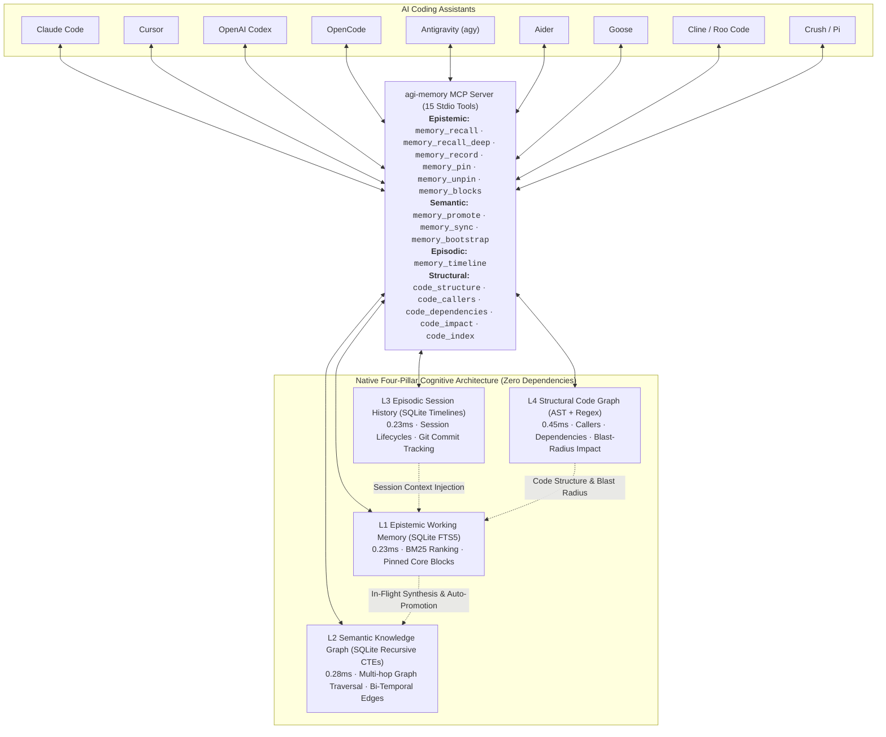

# Architecture



1. **L1 Epistemic Working Memory (`src/agi_memory/layers/session_layer.py`)**:
   - Sub-millisecond full-text search with BM25 ranking over recent session observations, bug fixes, and pinned core invariants.
   - Real-time conflict steering detecting overlapping precedents and prompting agents to resolve contradictions.
   - Core Memory blocks (`memory_pin`, `memory_unpin`, `memory_blocks`) unconditionally injected at session start.
   - Direct developer inspection & deletion APIs (`get_observation`, `delete_observation`, `list_observations`).
2. **L2 Semantic Knowledge Graph (`src/agi_memory/layers/graph_layer.py`)**:
   - Native SQLite graph tables (`graph_nodes`, `graph_edges`) with full-text search (`FTS5`).
   - Sub-millisecond (0.28ms) multi-hop recursive graph traversal using SQL Common Table Expressions (`WITH RECURSIVE`).
   - Bi-temporal edge invalidation and pure-SQL entity alias resolution (<0.01ms).
3. **L3 Episodic Session History (`src/agi_memory/layers/episodic_layer.py`)**:
   - Zero-dependency episodic memory answering *"What happened during previous agent sessions?"*
   - Tracks session start/end lifecycles, duration, touched files, events, and git commit deltas.
   - Cross-session recaps automatically injected on session start, giving every assistant instant continuity across restarts.
4. **L4 Structural Code Graph (`src/agi_memory/layers/code_layer.py`)**:
   - Zero-dependency code intelligence answering *"How is this codebase structurally connected?"*
   - Python stdlib `ast` + streaming regex parser for TypeScript, JavaScript, Go, Rust, and Dart with sha256 incremental hashing.
   - Microsecond symbol search (`code_structure`), incoming callers (`code_callers`), outbound imports/dependencies (`code_dependencies`), and blast-radius impact analysis (`code_impact`).
5. **Zero-Touch Cold-Start Seeder (`src/agi_memory/bootstrap.py`)**:
   - Automatically parses `README.md`, recent git commit logs, and indexes codebase symbols into L1 and L4 on Day 1.
   - Idempotent and zero-dependency, eliminating empty-vault churn.

---

---

# Universal Multi-Assistant Production Architecture

`agent-memory` introduces a standardized project blueprint that works across **Claude Code**, **Cursor**, **Windsurf**, **OpenAI Codex**, **OpenCode**, **Antigravity**, **Aider**, **Goose**, **Cline**, and **Roo Code** simultaneously:

```
your-project/
├── .mcp.json                 # Universal stdio MCP registration (Claude Code, Cursor, OpenCode)
├── CLAUDE.md                 # 100% byte-for-byte identical to AGENTS.md (<40 lines lean executive guide)
├── AGENTS.md                 # Universal instructions recognized by Codex, Cursor, Windsurf, Antigravity
├── rules/                    # Modular, versioned project invariants
│   ├── memory-discipline.md  # Recall before writing code, record after resolving non-trivial bugs
│   ├── architecture.md       # Zero external runtime pip dependencies invariant
│   ├── api-contracts.md      # MCP JSON-RPC 2.0 tool interface specifications
│   └── testing-qa.md         # Offline test checklists and coverage targets
├── context/                  # Durable project knowledge (loaded on-demand)
│   ├── domain-glossary.md    # Core domain concepts (L1, L2, Triples, Vault, Compaction)
│   ├── data-model.md         # SQLite schemas and JSONL vault specifications
│   └── runbook.md            # Operational runbooks (sync, dedupe, promote)
├── commands/                 # Standardized slash command playbooks
│   ├── test.md               # /test - Run offline unit tests & evaluation suites
│   ├── sync.md               # /sync - Force vault sync & compaction
│   ├── review.md             # /review - Code review checklist
│   └── fix-issue.md          # /fix-issue - Bug resolution workflow
├── agents/                   # Reusable specialist subagent instructions
│   ├── code-reviewer.md      # Architecture & convention auditor
│   └── security-auditor.md   # Zero-dependency & input sanitization auditor
├── hooks/                    # Deterministic offline quality gates
│   └── validate-offline.sh   # Pre-commit test runner (unit tests + evals + MCP handshake)
└── skills/agent-memory/      # Native skill definition for Antigravity, OpenCode, and Codex
```

### Key Benefits of This Universal Architecture:

1. **100% Parity Across All AI Assistants**:
   `CLAUDE.md` and `AGENTS.md` are **byte-for-byte identical** (verified by CI). Whether you invoke Claude Code, Cursor, Windsurf, Codex, or Antigravity, every assistant follows the exact same workflow and memory discipline without drift.

2. **Solving the Context Window Economy (No More 500-Line Prompt Bloat)**:
   Traditional AI projects dump massive 500–1,000 line rule files directly into the system prompt, burning 2,000–3,500 input tokens on *every single interaction*. `agent-memory` replaces prompt bloat with:
   - **Lean Executive Guides** (<40 lines in `CLAUDE.md` / `AGENTS.md`).
   - **Just-In-Time Memory Recall**: Assistants invoke `memory_recall` (<2ms) and `memory_recall_deep` (<0.5ms) to pull only the specific decisions, edge cases, and bugfixes relevant to the current task.
   - **Modular On-Demand Rules**: Deep context lives in `rules/` and `context/`, read only when needed.

3. **1-Command Project Scaffolding**:
   Bootstrap this universal architecture in any new or existing repository in seconds:
   ```bash
   python integrate.py init /path/to/my-repo --name my-repo
   ```
   This wires `.mcp.json`, `CLAUDE.md`, `AGENTS.md`, modular rules, lifecycle hooks, and the `/agi-init` slash command in every assistant's own format. Then run `/agi-init` inside your assistant: it reads the codebase and writes `rules/` and `context/` for real.

---
